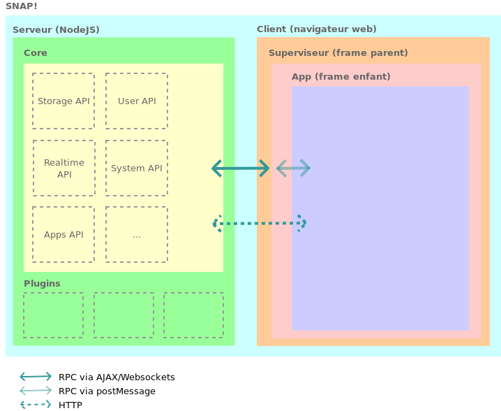

Architecture générale
=====================

  

* La partie serveur de SNAP! est développée en [NodeJS](https://nodejs.org).
* La version “desktop” utilise le projet [node-webkit](https://github.com/rogerwang/node-webkit) comme système hôte.
