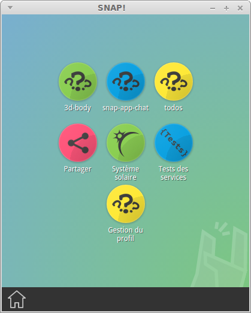

# Qu'est ce que SNAP! ?

<strong>Attention</strong> Le projet SNAP! est en cours de développement et l'application ne peut être considérée comme stable à son état d'avancement actuel.

    SNAP! est un projet libre de <strong>portail applicatif "nomade"</strong>.

    Il est pensé pour répondre aux besoins des personnes qui pourraient profiter d'outils numériques dans des lieux où une bonne connexion Internet n'est pas toujours disponible et où le parc matériel peut être hétérogène (smartphones, ordinateur de bureau, tablettes...).

    Exemples parmi d'autres:

    - Une salle de classe en ruralité
    - Une session de travail improvisée dans un train
    - Un hackathon...

    Pour grossir le trait, on pourrait présenter ça comme une "<a href="http://en.wikipedia.org/wiki/PirateBox" title="Page Wikipédia PirateBox">PirateBox++</a>" .

    Le portail se présente sous la forme d'une application de type "bureau" (ou en mode daemon/serveur classique), <strong>compatible GNU/Linux, Windows et prochainement MacOS</strong> qui expose au réseau local une série de micro applications (appelées "Apps") développées avec les technologies HTML5/Javascript.

    Ces "apps" s'appuient sur des services injectés dans le navigateur par SNAP!. Ceux ci sont prévus pour simplifier au maximum la mise en place de fonctionnalités comme la communication en temps réel entre les clients, la persistance de données, l'intégration des comptes utilisateurs... Ces services sont extensibles via un système de plugins.

    SNAP! est aujourd'hui principalement orienté vers le <strong>monde de l'éducation</strong>. Pour l'accompagner, un projet annexe au nom de code "App Builder" devrait permettre aux non développeurs de créer leurs propres "apps" en mode "glisser/déposer" à partir de composants de type "widget" (médias, texte, quiz, puzzle...).
  

  

