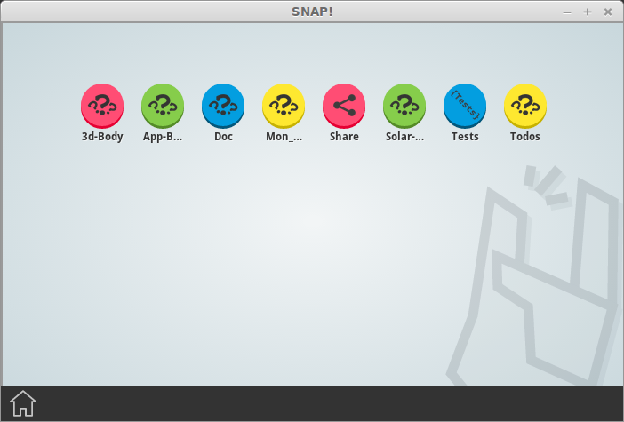
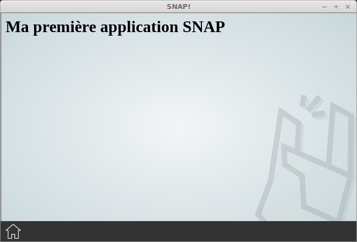

Créer une première "App"
========================

Structure de base
-----------------

A son plus simple niveau, une "App" est *un dossier* contenant un fichier `index.html`.
Celui ci représentera la page d'accueil de l'application.

Il est également possible de définir un fichier `manifest.webapp` qui apportera des informations supplémentaires
à SNAP! concernant le fonctionnement de votre application. Les détails concernant les informations présentes
dans ce fichier sont consultables [ici](../../documentation/client/app-manifest.md).

**Exemple d'arborescence**

```bash
mon_application/
  |-> index.html (obligatoire)
  |-> manifest.json (optionnel)
```

**index.html**

```
<html>
  <body>
    <h1>Ma première application SNAP</h1>
  </body>
</html>
```

"Installer" sa nouvelle App
---------------------------

Afin de pouvoir utiliser votre nouvelle application, déplacez votre dossier `mon_application` dans le sous dossier `apps` déjà présent dans le répertoire de l'application SNAP!

Cela devrait ressembler à peu prêt à ceci *(d'autres dossiers et/ou fichiers peuvent être présents)* :
```bash
snap/
  |-> config/
  |-> apps/
  |  |-> home/
  |  |-> wiki/
  |  |-> mon_application/
  |-> lib/
```

Tester
------

Lancez SNAP!.

En arrivant sur la page d'accueil, vous devriez voir:


Et en cliquant sur le bouton "Mon_application"


Utiliser les services SNAP!
---------------------------

La force de SNAP! par rapport à la création de simples applications HTML5 est la mise à disposition de "[services](../../documentation/client/services.md)" apportant des fonctionnalités supplémentaires à l'API Javascript commune aux navigateurs.

Envoi de messages en temps réel entre vos utilisateurs, accès aux informations de l'utilisateur courant, stockage de données en sont plusieurs exemples.

Afin d'utiliser les différents services proposés par SNAP!, intégrez dans votre page:

```
<script type="text/javascript" src="snap.js"></script>
<script type="text/javascript">

Snap.ready(function(err, services) {

  if(err) {

    // Une erreur est survenue pendant le processus d'initialisation des services.
    // Affichez un message prévenant vos utilisateur qu'un problème empêche la bonne
    // exécution de votre problème.

    alert(err);
    return;

  }

  // Commencez à utiliser les services ici:
  //
  // Exemple:

  // Récupérer la liste des Apps disponible sur le portail SNAP!
  services.apps.getAppsList(function(err, appsList) {
    // ...
  });

});

</script>
```
